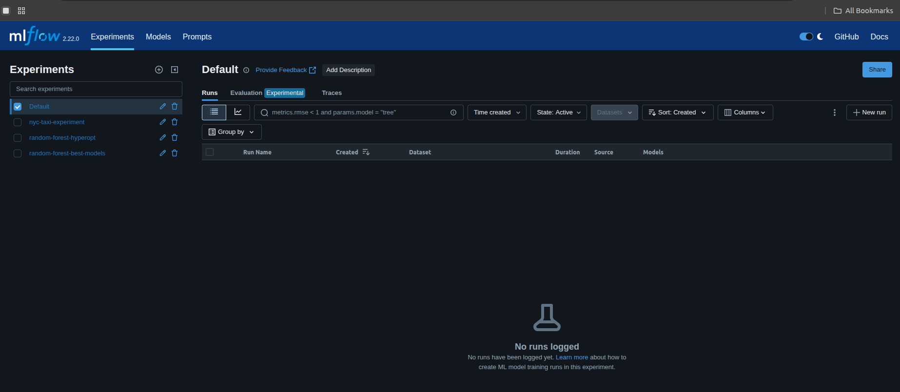
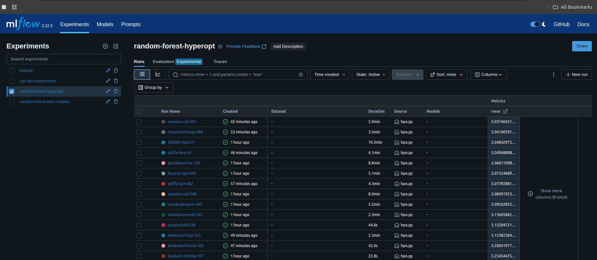
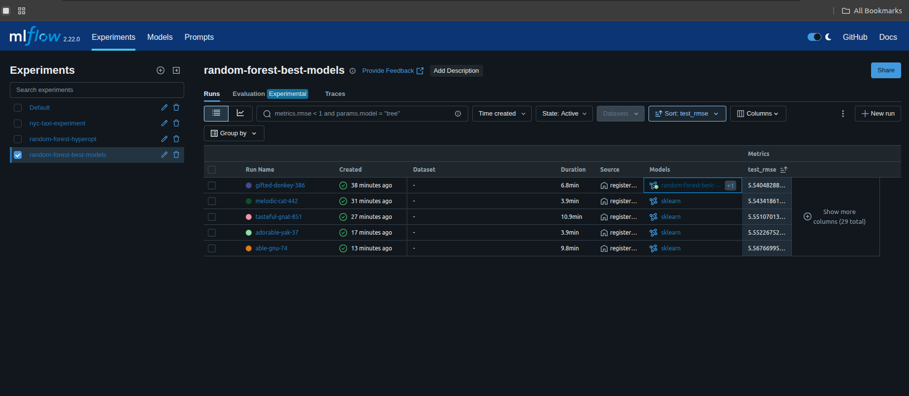

# MLOps Zoomcamp Homework 2 - My Solutions

Here's how I tackled each question for Homework 2.

## Q1. Install MLflow
First up, checked my MLflow version. Popped open the terminal and ran `mlflow --version`. Looks like I'm running version 2.22.0.

*(MLflow UI)*

## Q2. Download and preprocess the data
Ans: 4

Next, I ran the [`preprocess_data.py`](preprocess_data.py) script. This thing takes the raw taxi data, uses `DictVectorizer` on the January 2023 data to get it ready for training, and then saves out `train.pkl`, `val.pkl`, `test.pkl`, and the `dv.pkl` (the DictVectorizer itself). Ended up with 4 files in my output folder.

## Q3. Train a model with autolog
Ans: 2

For this one, I tweaked [`train.py`](train.py) to get MLflow's autologging working. Just added `mlflow.sklearn.autolog()` at the top and made sure the main training part was inside a `with mlflow.start_run():` block. The `RandomForestRegressor` in that script had `min_samples_split` set to 2.

## Q4. Launch the tracking server locally
Ans: default-artifact-root

Got the MLflow tracking server running using this command `mlflow server --backend-store-uri sqlite:///mlflow.db --default-artifact-root ./artifacts`. That `default-artifact-root` bit is key for telling MLflow where to stash the artifacts.

## Q5. Tune model hyperparameters
Ans: 4.817 ( i got 5.037)

Time for hyperparameter tuning! I edited the `objective` function in [`hpo.py`](hpo.py). Added `mlflow.log_params(params)` so I could see the hyperparameters for each go, and `mlflow.log_metric("rmse", rmse)` to keep track of the validation RMSE. The best validation RMSE I got from this was 5.037

## Q6. Promote the best model to the model registry
Ans: 5.567(i got 5.540)

Last step was to get the best model into the registry. I updated [`register_model.py`](register_model.py) to use `MlflowClient().search_runs()` to pick out the run with the best `test_rmse` from my "random-forest-best-models" experiment. Then, used `mlflow.register_model()` with the right `model_uri` (like "runs:/<RUN_ID>/model") to get it registered. The test RMSE for the model that made it to the registry was 5.540